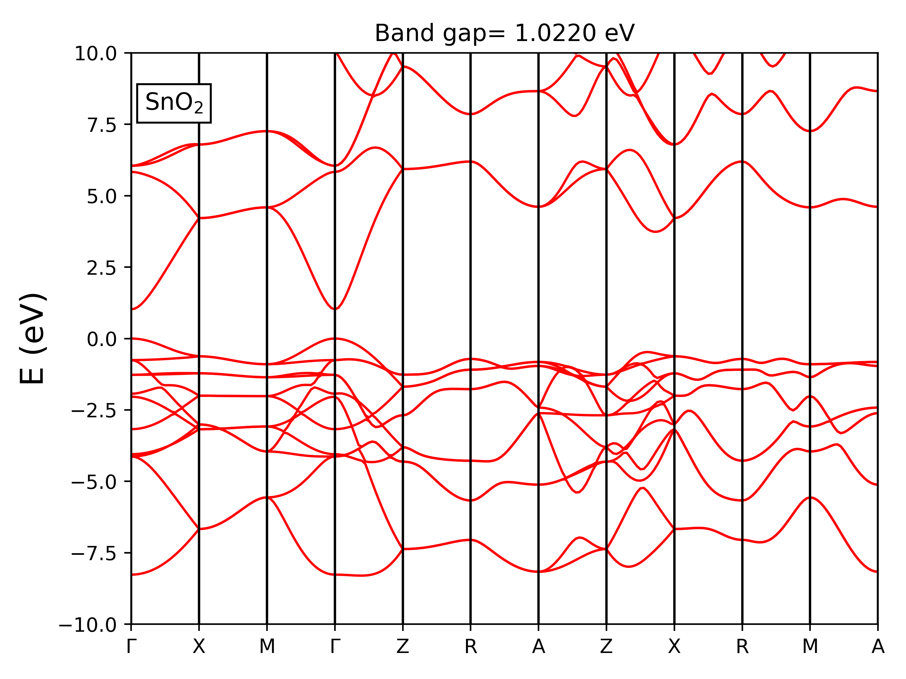

# QEbandplot

Usage:  
output file of bands.x are specified by  
filband='bd.dat'  
in the input of bands.x  

run as:  
`python pw_band_plot.py`

example:

## Projected band plot

Usage:
output file of projwfc.x are "filproj".projwfc_up

run as
`python proj_band.py`

Dependencies:

Numpy

[Matplotlib](https://matplotlib.org/).

